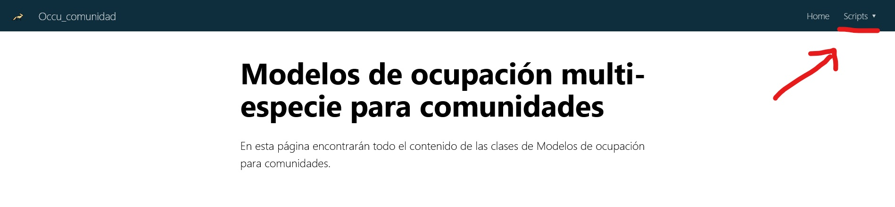

```{r setup, include=FALSE}
knitr::opts_chunk$set(echo = FALSE)

# Learn more about creating websites with Distill at:
# https://rstudio.github.io/distill/website.html

```

## Bienvenidos 🙌

En esta página encontrarán las presentaciones y los scripts para los ejercicios de modelos de ocupación de comunidades.

Es importante que sigan las instrucciones e instalen paquetes y adicionales previo al taller. De lo contrario muy probablemente se queden atrás.

## Instalación de paquetes y programas adicionales

### Rtools

Para instalar Rtools hay que ir a este [enlace](https://cran.r-project.org/bin/windows/Rtools/) , escoger el Rtools dependiendo de la versión de R que tengas instalada. Descargar el archivo **.exe** la versión dependiendo de si el computador es de 64 o 32 bits. Abrir el archivo descargado e instalar como cualquier otro programa.

### Paquetes de R

Usen el siguiente código en R para instalar los paquetes necesarios.

```{r eval=FALSE, message=FALSE, warning=FALSE, echo=TRUE}
install.packages(c("DiversityOccupancy", # Diversidad y ocupación
                   "tidyverse", # Manejo de datos y gráficas
                   "hillR", # Perfiles de diversidad
                   "ggeffects", #Gráficos de glms
                   "beepr", #opcional 
                   "tictoc", #opcional
                   "SpadeR" # Riqueza de especies
                   ))
```

### Versión de desarrollo de CamtrapR

```{r eval=FALSE, message=FALSE, warning=FALSE, echo=TRUE}
# Requiere tener instalado la librería de remotes
remotes::install_github("jniedballa/camtrapR")
```


### Instalar JAGS para los modelos con enfoque Bayesiano

Es necesario ir a esta página e instalar el programa siguiendo las instrucciones
*[JAGS](https://sourceforge.net/projects/mcmc-jags/files/)*
Una vez instalado JAGS podemos regresar a Rstudio e instalar `rjags` 

```{r message=FALSE, warning=FALSE, eval=FALSE, echo=TRUE}
install.packages("rjags")

# Pueden instalar Nimble también

install.packages(c("nimble", "nimbleEcology"))

```


## Presentación

```{r share-again, echo=FALSE}
xaringanExtra::use_share_again()
```

```{r embed-xaringan, echo=FALSE, fig.cap="[Slides](slides/index.html)"}
xaringanExtra::embed_xaringan(url = "slides/multi_sp_GAP.html", ratio = "16:9")
```
\

+ [Diapositivas completas](slides/multi_sp_GAP.html)


## Descarga scripts y bases de datos

### Descargar todo el proyecto

Puedes descargar todo el proyecto de R, que contiene el proyecto de R, scripts, archivos Rmarkdown y presentación. Pica en el boton de descargar proyecto, y extrae el archivo .zip donde lo desees.

```{r echo=FALSE}
downloadthis::download_link(
  link = "https://github.com/gpandradep/Ocupacion_comunidades/archive/refs/heads/main.zip",
  button_label = "Descargar proyecto",
  button_type = "primary",
  has_icon = TRUE,
  icon = "fa fa-save",
  self_contained = FALSE
)

```

### Descargar scripts y bases de datos por separado

Puedes descargar los scripts y bases por separado. Clic en el botón respectivo, se abrirá una ventana donde le puedes dar clic derecho (ctrl + s) y guardar como (save as).

- Aquí para la base de actividad de cámaras:

```{r echo=FALSE}
downloadthis::download_link(
  link = "https://raw.githubusercontent.com/gpandradep/Ocupacion_comunidades/main/Data/Survey/CTtable_OC.csv",
  button_label = "Actividad de cámaras",
  button_type = "danger",
  has_icon = TRUE,
  icon = "fa fa-save",
  self_contained = FALSE
)
```

- Aquí la base de registro de especies

```{r echo=FALSE}
downloadthis::download_link(
  link = "https://raw.githubusercontent.com/gpandradep/Ocupacion_comunidades/main/Data/Survey/recordTable_OC.csv",
  button_label = "Registro de especies",
  button_type = "danger",
  has_icon = TRUE,
  icon = "fa fa-save",
  self_contained = FALSE
)
```

- Aquí las covariables

```{r echo=FALSE}
downloadthis::download_link(
  link = "https://raw.githubusercontent.com/gpandradep/Ocupacion_comunidades/main/Data/Covs/stdcovs_OC.csv",
  button_label = "Covariables",
  button_type = "danger",
  has_icon = TRUE,
  icon = "fa fa-save",
  self_contained = FALSE
)
```

- Para descargar cada scrips, ir a la parte superior derecha del navegador, seleccionar el scripts, se abrirá una nueva página con el script con su correspondiente botón de descarga.



> NOTA: Al descargarlos por separado es importante saber que tienes que cambiar la dirección de lectura en los scripts, dependiendo de donde guardas las bases de datos.

```{r message=FALSE, warning=FALSE, eval=FALSE, echo=TRUE}
covars <- read.csv("carpeta donde guartaste covariables/covars.csv")
```


## Bibliografía

Insertar cuando este el link


## Adicional {.appendix}

Esta página esta hecha con el paquete [distill package](https://rstudio.github.io/distill/)