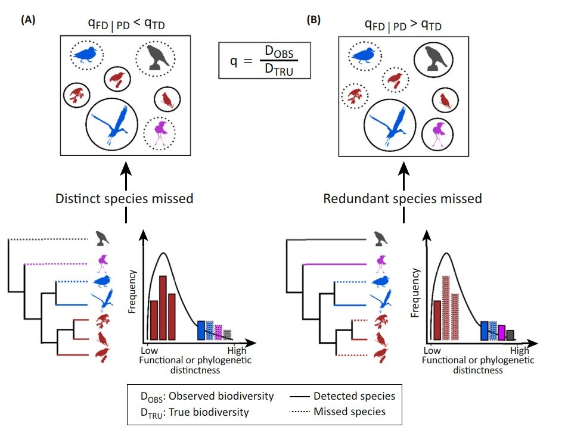

```{r setup, include=FALSE}
knitr::opts_chunk$set(echo = TRUE)
```

```{r echo=FALSE}
downloadthis::download_link(
  link = "https://github.com/gpandradep/Ocupacion_comunidades/blob/main/R/multioccu_script.R",
  button_label = "Descargar script multioccu",
  button_type = "danger",
  has_icon = TRUE,
  icon = "fa fa-save",
  self_contained = FALSE
)
```

# Script `multioccu_script.R`

# 1. Instalar y cargar los paquetes ----

Recuerden instalar la versión de desarrollo de camtrapR

```{r message=FALSE, warning=FALSE, eval=FALSE}
remotes::install_github("jniedballa/camtrapR")
```

 Lo primero es cargar todas las librerias necesarias.
> Recuerden que para instalar rjags necesitan instalar en su maquina el programa [JAGS](https://sourceforge.net/projects/mcmc-jags/files/)

```{r}
library(camtrapR) # Datos de cámaras y modelos
library(rjags) # Para correr el modelo
library(SpadeR) # Riqueza Chao2
library(tidyverse) # Manipular datos
library(nimble) # LEnguaje BUGS
library(nimbleEcology) # Nimble enfocado en jerárquicos
library(bayesplot) # gráficos estimaciones bayesianas
library(SpadeR) # Riqueza Chao2
library(beepr) # Opcional para avisar R termine
library(tictoc) # Opcional para tomar el tiempo de la función
library(extrafont) #opcional para cambiar la fuente
library(snowfall)
```


# 2. Cargar los datos ----

## Formato de los datos

Vamos a usar los mismos datos que del ejemplo anterior. Seguimos un procedimiento similar para cargar los datos.


```{r message=FALSE, warning=FALSE, eval=FALSE, echo=TRUE}
# Cargamos la tabla de registros de las especies
registers <-  read.csv("Data/Survey/recordTable_OC.csv")

# Cargamos la tabla de operación de cámaras
CToperation <-  read.csv("Data/Survey/CTtable_OC.csv") 

# Generamos la matríz de operación de las cámaras

camop <- cameraOperation(CTtable= CToperation, # Tabla de operación
                         stationCol= "Station", # Columna que define la estación
                         setupCol= "Setup_date", #Columna fecha de colocación
                         retrievalCol= "Retrieval_date", #Columna fecha de retiro
                         hasProblems= T, # Hubo fallos de cámaras
                         dateFormat= "%Y-%m-%d") # Formato de las fechas


```

```{r message=FALSE, warning=FALSE, echo=TRUE, eval=FALSE}
# Función para generar las historias de detección para todas las especies seleccionadas

DetHist_list <- lapply(unique(registers$Species), FUN = function(x) {
  detectionHistory(
    recordTable         = registers, # Tabla de registros
    camOp                = camop, # Matriz de operación de cámaras
    stationCol           = "Station",
    speciesCol           = "Species",
    recordDateTimeCol    = "DateTimeOriginal",
    recordDateTimeFormat  = "%d/%m/%Y",
    species              = x,     # la función reemplaza x por cada una de las especies
    occasionLength       = 10, # Colapso de las historias a 10 ías
    day1                 = "station", #inicie en la fecha de cada estación
    datesAsOccasionNames = FALSE,
    includeEffort        = TRUE,
    scaleEffort          = TRUE,
    timeZone             = "America/Mexico_City" 
  )}
)

# Se genera una lista con cada historia de detección y el esfuerzo de muestreo, ahora le colocaremos los nombres para saber a cual especie corresponde
names(DetHist_list) <- unique(registers$Species)

# Finalmente creamos una lista nueva donde estén solo las historias de detección
ylist <- lapply(DetHist_list, FUN = function(x) x$detection_history)
```

Terminaremos con el objeto ylist que cotiente todas las historias de detección


#### covariables

```{r message=FALSE, warning=FALSE}
## Covariables 

#Cargamos la base de covariables
covars <- read.csv("Data/Covs/stdcovs_OC.csv")

identical(nrow(ylist[[1]]), nrow(covars)) # Verificar que tengan el mismo número de filas
```


Finalmente unimos todo en un objeto lista con los datos que requiere el modelo

```{r}
# Generamos la base de datos para el modelo
data_list <- list(ylist    = ylist, # Historias de detección
                  siteCovs = covars, # Covariables de sitio
                  obsCovs  = list(effort = DetHist_list[[1]]$effort))  # agregamos el esfuerzo de muestreo como covariable de observación

str(data_list)
```

# 3. Modelo multi-especie ----
### Creando el modelo

CamtrapR permite ajustar modelos multi-especie en JAGS y Nimble (es decir en lenguaje BUGS), nosotros vamos a usar JAGS ya que la versión de Nimble aun no permite estimar parámetro N de riqueza de especies


```{r}
# Usaremos la función ` communityModel`

# Generemos el modelo
comu_model <- communityModel(data_list, # la lista de datos
                             occuCovs = list(ranef = "Dcrops"), # La covariables de sitio
                             detCovsObservation = list(fixed = "effort"), #Covariables de observación
                             intercepts = list(det = "ranef", occu = "ranef"),
                             augmentation = c(full = 30),# Número aumentado de especies
                             modelFile = "multmod")# Guardamos la especificación en un archivo


```


```{r}
summary(comu_model)
```

Hora de correr el modelo. En este caso no corran la función porque dura alrededor de 56 min

```{r eval=F, message=FALSE, warning=FALSE}
fit.commu <- fit(comu_model,
                 n.iter = 22000, 
                 n.burnin = 2000,
                 thin = 2,
                 chains = 3,
                 cores = 3,
                 quiet = T
);beep(sound = 4)

# Duración 56 min aprox
```

```{r message=FALSE, warning=FALSE, echo=FALSE, eval=TRUE}
load("results/DR_result.R")
```

### 3.1 Resultados del modelo

```{r message=FALSE, warning=FALSE}
modresult <- summary(fit.commu)[["statistics"]]

```


```{r message=FALSE, warning=FALSE, echo=FALSE}
DT::datatable(round(modresult, 3))
```

Veamos el resultado gráfico

Otra gran ventaja de CamtrapR es que permite gráficar de manera muy sencilla la predicción posterior del modelo. Veamos que pasa con la ocupación de cada especie

```{r message=FALSE, warning=FALSE, eval=FALSE}
plot_effects(comu_model, # El modelo
             fit.commu, # El objeto ajustado
             submodel = "state") # el parámetro de interés
```


```{r echo=FALSE, message=FALSE, warning=FALSE, fig.height=5}
plot_effects(comu_model, # El modelo
             fit.commu, # El objeto ajustado
             submodel = "state") # el parámetro de interés
```


Ahora los coeficientes

```{r message=FALSE, warning=FALSE}
plot_coef(comu_model,
          fit.commu,
          submodel = "state")
```

Realizamos el mismo procedimiento para el submodelo de detección

```{r message=FALSE, warning=FALSE}
plot_effects(comu_model,
             fit.commu,
             submodel = "det")

```

 y sus respectivos coeficientes
```{r message=FALSE, warning=FALSE}
plot_coef(comu_model,
          fit.commu,
          submodel = "det")
```

### 3.2 La riqueza de especies
Lo que vinimos a buscar fue la riqueza de especies. La riqueza estimada de especies es ~20 sps

```{r message=FALSE, warning=FALSE}
(riqueza_est <- modresult["Ntotal",])
```

```{r, eval=FALSE}
# Veamos el gráfico de la distribución posterior
mcmc_areas(fit.commu, # objeto jags
           pars= "Ntotal", # parámetro de interés
           point_est = "mean",
           prob = 0.95) # intervalos de credibilidad
```

```{r echo=FALSE, message=FALSE, warning=FALSE}
# Veamos el gráfico de la distribución posterior
mcmc_areas(fit.commu, # objeto jags
           pars= "Ntotal", # parámetro de interés
           point_est = "mean",
           prob = 0.95) # intervalos de credibilidad
```

La estimación no se ve muy bien, hay que verificar los trace plots.

Debería verse como un cesped, muy probablemente necesitamos muchas mas iteraciones para este modelo.

```{r message=FALSE, warning=FALSE}
mcmc_trace(fit.commu, pars = "Ntotal")
```


```{r}
gd <- as.data.frame(gelman.diag(fit.commu,  multivariate = FALSE)[[1]])
gd["Ntotal",]
```

La prueba de Gelman-Rubin debe ser ~1 para considerar que hay buena convergencia. Aunque tenemos un valor bueno para Ntotal, hay varios valores de omega con NA, eso puede estar causando los problemas.


Ajustamos nuestro primer modelo de multi-especie. 

Recordemos que **N** es la riqueza estimada a un **área mayor** de nuestro muestreo (área que no conocemos)

 **N** depende de si cumplimos los supuestos del área
- El muestreo es aleatorio. El área de muestreo debe **representar la región**
- En caso contrario N representa el número de especies un área hipotética con **las mismas condiciones**
- Si la región es pequeña, **N** puede ser **sobre-estimada**

y de las especies
- Datos de **insectos** no sirven para predecir aves
- Predicción a especies que sean **detectados de manera similar** con la metodología usada.

.footnote[Guillera-Arroita, G, Kéry, M, Lahoz-Monfort, JJ. Inferring species richness using multispecies occupancy modeling: Estimation performance and interpretation. Ecol Evol. 2019; 9: 780– 792. https://doi.org/10.1002/ece3.4821]
]

# 4. Estimador clásico

¿Será mejor que un estimador no-paramétrico?

```{r message=FALSE, warning=FALSE}
# Riqueza con Chao2----

# Formatear los datos a un vector de frecuencia
inci_Chao <- ylist %>%  # historias de captura
  map(~rowSums(.,na.rm = T)) %>% # sumo las detecciones en cada sitio
  reduce(cbind) %>% # unimos las listas
  t() %>% # trasponer la tabla
  as_tibble() %>% #formato tibble
  mutate_if(is.numeric,~(.>=1)*1) %>%  #como es incidencia, formateo a 1 y 0
  rowSums() %>%  # ahora si la suma de las incidencias en cada sitio
  as_tibble() %>% 
 add_row(value= 67, .before = 1) %>%  # el formato requiere que el primer valor sea el número de sitios
  as.matrix() # Requiere formato de matriz


# Calcular la riqueza con estimadores no paramétricos
chao_sp <- ChaoSpecies(inci_Chao, datatype = "incidence_freq")

NIChao <- chao_sp$Species_table[4,c(1,3,4)] # Extraer valores de IChao

Nocu<- mcmc_intervals(fit.commu, 
                      pars = "Ntotal", 
                      prob = 0.95,
                      prob_outer = 0.99, 
                      point_est = "mean")[[1]] %>%  # Extraer valores del bayes plot
  select(m,l,h) %>% # Seleccionar columnas
  rename("Estimate"= m, # Renombrarlas
         "95%Lower"= l,
         "95%Upper"= h)

```


Veamos de manera gráfica que tanto difieren las estimaciones de la riqueza

```{r message=FALSE, warning=FALSE}

# Unir en un solo dataframe
Nplotdata <- rbind(IChao=NIChao, DR.mod=Nocu) %>% 
  as.data.frame() %>% 
  rownames_to_column(.)

# Gráfico para comparar la riqueza estimada
plotN <- ggplot(Nplotdata, aes(x=rowname, y= Estimate, col=rowname))+
  geom_point(aes(shape=rowname),size=3)+
  geom_errorbar(aes(ymin= `95%Lower`, ymax= `95%Upper`), 
                width=.3, size=1)+
  labs(x="Estimador de riqueza",
       y="Número de especies estimado", 
       title = "Diferencia de los estimadores de riqueza")+
  theme_classic()+
  theme(text=element_text(size = 13), 
        plot.title = element_text(hjust= 0.5), 
        legend.position = "none")

```


```{r echo=FALSE, fig.height=5}
plotN
```


### Ocupación multi-specie vs IChao


.footnote[ Tingley, MW, Nadeau, CP, Sandor, ME. Multi-species occupancy models as robust estimators of community richness. Methods Ecol Evol. 2020; 11: 633– 642. https://doi.org/10.1111/2041-210X.13378]


Ambos lo hacen muy mal cuando $\psi_k$ es muy **bajo**

- **Chao** siempre estará sesgado al valor **más bajo de N** por no considerar la detección (De hecho Chao lo reconoce)
- Los modelos de ocupación son muy **hambrientos** de datos
- Tienes que saber "**programar**" para ajustar modelos multi-specie 
- Todavía hay algunos bmoles con la heterogeneidad y los prior (Guillera-Arroita et al. 2019)


# 5.1 Otros ejemplos

Las posibilidades son infinitas
1. Estructura de la diversidad- Número efectivo de especies


1. Estructura de la diversidad- Número efectivo de especies

Cómo la presencia o no de leones afecta la riqueza de meso-carnívoros

>Curveira-Santos Gonçalo, Sutherland Chris, Tenan Simone, Fernández-Chacón lbert, Mann Gareth K. H., Pitman Ross T.and Swanepoel Lourens H. 2021. Mesocarnivore community structuring in the presence of Africa's apex predator. Proc. R. Soc. B.2882020237920202379. http://doi.org/10.1098/rspb.2020.2379


2. Diversidad funcional y filogenética

Las consecuencias de no considerar a especies no detectadas en los análisis.

> Jarzyna, M. A., & Jetz, W. (2016). Detecting the multiple facets of biodiversity. Trends in ecology & evolution, 31(7), 527-538. https://doi.org/10.1016/j.tree.2016.04.002


Les dejo ejemplos divertidos en la carpeta de bibliografía





