```{r setup, include=FALSE}
library(knitr)
library(tidyverse)
library(icon)
library(emo)
library(xaringanExtra)
library(countdown)
library(hillR)
library(ggeffects)
library(DiversityOccupancy)
library(camtrapR)
library(xaringanExtra)


options(htmltools.dir.version = FALSE)
knitr::opts_chunk$set(
  fig.width=9, fig.height=3.5, fig.retina=3,
  out.width = "100%",
  cache = FALSE,
  echo = TRUE,
  message = FALSE, 
  warning = FALSE,
  fig.show = TRUE,
  hiline = TRUE,
  root.dir= "D:/Inecol/Proyectos/Cursos/Ocupacion_comunidades"
)
```

```{r xaringan-themer, include=FALSE, warning=FALSE}
library(xaringanthemer)
style_duo_accent(
  primary_color = "#035AA6", 
  secondary_color = "#95dfef",
  header_font_google = google_font("Cabin"),
  text_font_google   = google_font("Coming Soon", "400", "400i"),
  code_font_google   = google_font("Roboto")
)

#xaringanExtra::use_panelset()
xaringanExtra::use_share_again()
xaringanExtra::style_share_again(
  share_buttons = c("twitter")
)
xaringanExtra::use_tile_view()
```

class: center, top, inverse
background-image: url("img/coati.jpg")
background-position: 60% 60%
background-size: cover

# `r rmarkdown::metadata$title`
# `r rmarkdown::metadata$subtitle`


---

name: hola
class: center, middle

## Gabriel Andrade Ponce `r emo::ji("colombia")`

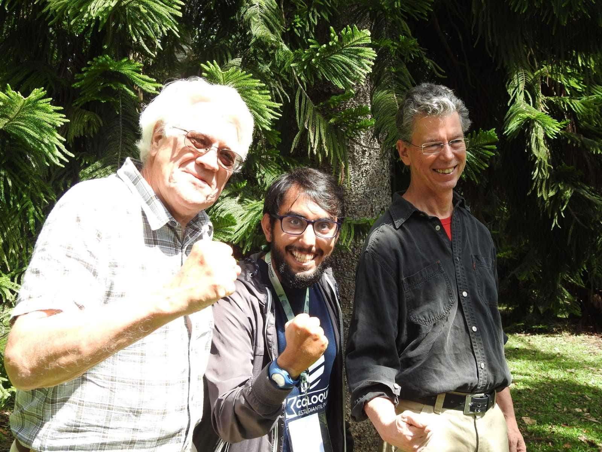

### Estudiante de Doctorado
.fade[Instituto de Ecología A.C, Xalapa, Ver., Mex]

[`r icons::fontawesome("twitter")`@Gatorco_AP](https://twitter.com/Gatorco_AP)
[`r icons::fontawesome("github")`@gpandradep](https://github.com/gpandradep)
`r icons::fontawesome("envelope", style = "solid")` gpandradep@gmail.com
---
class: center

# En este taller vamos a ver dos aproximaciones

## 1. Modelar la "abundancia" con modelos jerárquicos

Predecimos las "abundancias" o intensidad de las especies para usarlas como insumo en los cálculos de diversidad

## 2. Usamos modelos jerárquicos para estimar riqueza

Usamos directamente una proximación jerárquica para estimar la riqueza de especies de una localidad

---
name: det1

# La detección imperfecta

Es cuando la probabilidad de detectar una especie dado que esté presente en nuestro sitio sea menor a 1
.pull-left[
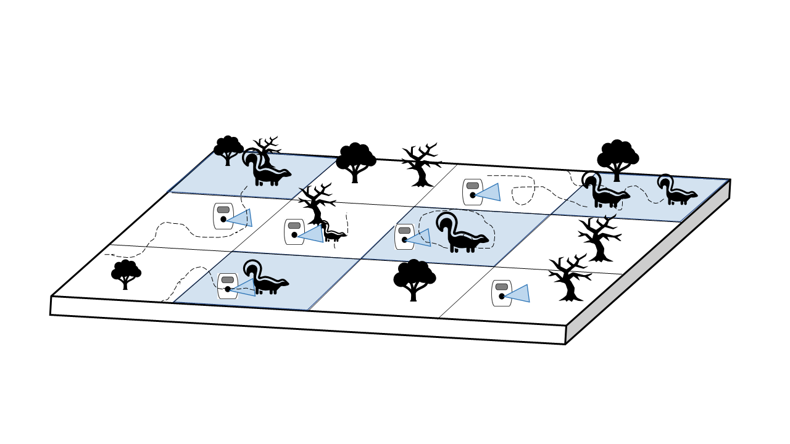
]
.pull-right[
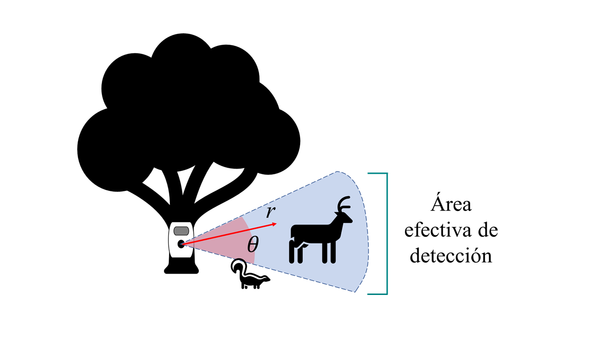
]
---
class: midle
# La detección imperfecta

.pull-left[


.footnote[Tourani, M., Brøste, E.N., Bakken, S., Odden, J. and Bischof, R. (2020), Sooner, closer, or longer: detectability of mesocarnivores at camera traps. J Zool, 312: 259-270. https://doi.org/10.1111/jzo.12828]
]

.pull-right[
Cada especie tiene su propia probabilidad de ser detectada y puede depender de:

- El tamaño
- La velocidad de paso
- La distancia a la cámara
- El tiempo de muestreo
- Abundancia
- Entre otros....
<br>]

---
class: center, middle
## Modelos de jerárquicos al rescate

Son dos o más modelos probabilísticos, condicionados por las variables de probabilidad que describen. <br>

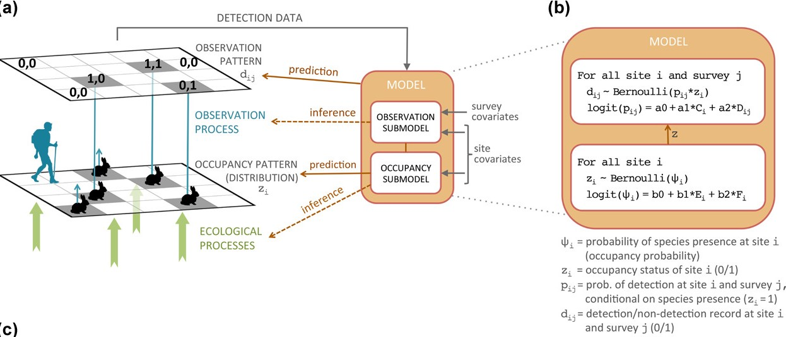
---
class: center
### La función que vamos a utilizar usa como base el modelo Royle-Nichols [(Royle & Nichols 2003)](https://esajournals.onlinelibrary.wiley.com/doi/10.1890/0012-9658%282003%29084%5B0777%3AEAFRPA%5D2.0.CO%3B2)

.pull-left[
# Ecológico

Describe la variable de estado ecológica de interés
<br>

En este caso describe la abundancia 

$$N\sim Poisson (\lambda) $$
]

.pull-right[
# Observacional

Describe el proceso mediante el cual se toman los datos

$$ p= 1- (1-r)^N  $$

$$ y \sim Bernoulli (p)$$

]
---
class: inverse, middle, center
background-image: url("img/biodiv.jpg")
background-position: center
background-size: cover

# .big-text[ Diversidad con modelos jerárquicos]
---
## Script `DivOC_script.R`
### Comenzaremos usando la paquetería `DiversityOccupancy`

Este paquete estima la diversidad alfa por medio de modelos jerárquicos. 


```{r, eval=FALSE}
# 1. Instalar y cargar el paquete ----

# install.packages("DiversityOccupancy")

library(DiversityOccupancy)
library(camtrapR)
library(tidyverse)
library(hillR) # Estimar diversidad
library(ggeffects) #gráficas de pred para glm
library(beepr) # Opcional para avisar R termine
library(tictoc) # Opcional para tomar el tiempo de la función
```

Este paquete te va a pedir instalar también `MuMIn`, `unmarked`, `reshape`, `lattice`, `Rcpp`
---
## Formato de los datos

Son necesarios eventos de muestreo repetidos. 
<br>

Vamos a trabajar con una base de datos de 17 especies, 67 sitios (cámaras) y 16 eventos de muestreo.

> **Nota**: Todas las especies deben tener una matriz de historias de detección de las mismas dimensiones

```{r}
# Cargamos la tabla de registros de las especies
registers <-  read.csv("Data/Survey/recordTable_OC.csv")
table(registers$Species)

# Cargamos la tabla de operación de cámaras
CToperation <-  read.csv("Data/Survey/CTtable_OC.csv") 

# Generamos la matríz de operación de las cámaras

camop <- cameraOperation(CTtable= CToperation, # Tabla de operación
                         stationCol= "Station", # Columna que define la estación
                         setupCol= "Setup_date", #Columna fecha de colocación
                         retrievalCol= "Retrieval_date", #Columna fecha de retiro
                         hasProblems= T, # Hubo fallos de cámaras
                         dateFormat= "%Y-%m-%d") # Formato de las fechas

```

---
```{r}
# Función para generar las historias de detección para todas las especies seleccionadas

DetHist_list <- lapply(unique(registers$Species), FUN = function(x) {
  detectionHistory(
    recordTable         = registers, # Tabla de registros
    camOp                = camop, # Matriz de operación de cámaras
    stationCol           = "Station",
    speciesCol           = "Species",
    recordDateTimeCol    = "DateTimeOriginal",
    recordDateTimeFormat  = "%d/%m/%Y",
    species              = x,     # la función reemplaza x por cada una de las especies
    occasionLength       = 10,  # Colapso de las historias a 10 días
    day1                 = "station", #inicie en la fecha de cada estación
    datesAsOccasionNames = FALSE,
    includeEffort        = TRUE,
    scaleEffort          = TRUE,
    timeZone             = "America/Mexico_City" 
  )}
)

# Se genera una lista con cada historia de detección y el esfuerzo de muestreo, ahora le colocaremos los nombres para saber a cual especie corresponde
names(DetHist_list) <- unique(registers$Species)

# Finalmente creamos una lista nueva donde estén solo las historias de detección
ylist <- lapply(DetHist_list, FUN = function(x) x$detection_history)

# Todas las historias deben tener el mismo número de sitios y de ocasiones de muestreo

data <- ylist %>% # Lista con los datos
  reduce(cbind) # Unimos las historias de captura en un solo dataframe
```


---
.center[## Formato de los datos]

Obtenemos una matriz con el mismo número de sitios **67** y *19* eventos X *19* especies = 323 columnas 

```{r echo=FALSE}
DT::datatable(head(data))
```
---
# Cargar las covariables
Vamos a leer el archivo .csv de la ruta `data/Covs/` que contiene las covariables de sitio (no usaremos de observación). Todas estas estandarizadas


```{r}
# Ahora cargamos las covariables (previamente estandarizadas)
covars <- read.csv("Data/Covs/stdcovs_OC.csv") %>% 
  select(-"...1", -X, -Station, -Cam, -Cluster) # Las gráficas no funcionan con categóricas
```


```{r echo=FALSE}
knitr::kable(head(covars,4), format = 'html')
```


> **Importante**: Cada proceso es afectado por diferentes covariables. Para más información mira este **[enlace](https://mmeredith.net/blog/2021/Polar_bear.htm?fbclid=IwAR2XKX0X9Lu-Bqu2skniXNJV54dsMqy0lb7AdFZpoCR4ZN1E5Yt71rLvgF4)**

---
# Manos a la obra

### Vamos a utilizar la función `diversityoccu()`

Se genera un objeto lista con los modelos para cada una de las especies, cálculo de diversidad y otras cosas....

```{r message=FALSE, warning=FALSE}
cam_diver <- diversityoccu(pres = data, # La matriz de datos
     sitecov = covars, # Covariables de sitio
     obscov = NULL, # no tenemos covariables de observación,
     spp = 16, # Número de especies
     form = ~ Effort + Slope ~ Dcrops, # Formula del modelo p(), lambda()
     dredge = FALSE # En este primer ejemplo no usaremos AIC
     )

```

Se va a generar un objeto lista con los modelos para cada una de las especies, cálculo de diversidad y otras cosas....
---
### Veamos uno de los modelos &#x1F43A;

```{r}
cam_diver$models[[9]] # Modelo para la especie 9 
```

---
class: inverse, center
# El problema.....

No sabemos si todas las especies responden de la misma manera a las covariables que usamos. Debemos escoger de todas las variables cual se ajusta mejor a cada especie

.pull-left[

### ¿Cómo vamos a generar todas las posibles combinaciones de modelos para cada especie?
]
--
.pull-right[

 Tranquilo esta misma función lo hace por ti :D
]
---
## Solamente tenemos que activar `dredge`

Dependiendo de tu computador la función puede tardar más o menos. En la mía duró ~57 segs.
Pero puede tardar mucho más dependiendo del número de especies, sitios, eventos de muestreo y cantidad de covariables.

```{r, eval=FALSE}
cam_diver_AIC <- diversityoccu(pres = data, # La matriz de datos
                           sitecov = covars, # Covariables de sitio
                           obscov = NULL, # no tenemos covariables de observación,
                           spp = 17, # Número de especies
                           form = ~ Effort + Slope ~ Dcrops, # Formula del modelo p(), lambda()
                           dredge = TRUE # escoge los mejores modelos con AIC
)
```

```{r message=FALSE, warning=FALSE, include=FALSE}
load("results/diver_AIC.R")
```
---
class: center
## Veamos de nuevo el modelo que seleccionó para la sp9 &#x1F43A;
.pull-left[
```{r}
cam_diver$models[[9]]
```
]

.pull-right[
```{r}
cam_diver_AIC$models[[9]]
```
]
---
class: center
### Veamos el resultado gráfico para la especie 3 &#128023;

```{r}
(responseplot.abund( batch = cam_diver_AIC, # objeto creado con diversityoccu
                    spp = 3, # número o nombre de la sp
                    variable= Dcrops # variable  
))
```

---
class: center
# Momento de la diversidad

Tenemos un modelo donde se estima la abundancia para cada especie, es hora de modelar la diversidad

```{r ,eval=FALSE}
glm.div <- model.diversity(DivOcc = cam_diver_AIC,# modelos
                           method = "h", # método
                           delta = 2, 
                           squared = T # términos cuadráticos
                                                     )
```

```{r message=TRUE, warning=TRUE, include=FALSE}
load("results/diver_glm.R")
```

---
class: center
# Momento de la diversidad

```{r}
AICtab <- glm.div$Table
```

```{r echo=FALSE}
knitr::kable(AICtab, format = 'html')
```

---
### Ahora veamos la respuesta gráfica de la diversidad a una variable
```{r}
responseplot.diver(glm.div, Dcrops)
```
A medida que aumenta el valor de distancia a cultivos (escalado) hay mayor diversidad ?????

---
class: inverse, center, middle

# Relativamente fácil


# Para ser verdad .....
---
# Diversidad....

Si seguimos la viñeta del paquete nunca nos dice que elemento de la diversidad mide o calcula..

- Riqueza?
- Shannon, simpson?....
- Número efectivo de especies?? (Hill)
--

# Glm? de que tipo?
Un Glm puede ser de varias familias (distribuciones) y depende de la naturaleza de los datos: conteos, proporciones, unos y ceros

---
class: center
# Es importante leer el manual
.pull-left[

]
.pull-right[
 Hay otro argumento de la función `diversityoccu` y es *"index"*. Este argumento permite escoger que índice utilizar **"shannon"**, **"simpson"** o **"invsimpson"**.

```{r, eval=FALSE}
cam_diver_sh <- diversityoccu(pres = data, 
                           sitecov = covars, 
                           obscov = NULL, 
                           spp = 17, 
                           form = ~ Effort + Slope ~ Dcrops,
                           dredge = TRUE, 
                           index = "shannon" #<<
)
```

]

---
## Podemos aplicar la función para cada índice...?
> También se puede hacer una función que lo haga en automático, pero por simplicidad (~~no se hacerlo bien~~) corremos tres veces la función


```{r, eval=FALSE}
cam_diver_sim <- diversityoccu(pres = data, 
                           sitecov = covars, 
                           obscov = NULL, 
                           spp = 17, 
                           form = ~ Effort + Slope ~ Dcrops,                            dredge = TRUE,  
                           index = "simpson" #<<
)

cam_diver_inv <- diversityoccu(pres = data, 
                           sitecov = covars, 
                           obscov = NULL, 
                           spp = 17, 
                           form = ~ Effort + Slope ~ Dcrops,                            dredge = TRUE,  
                           index = "invsimpson" #<<
)
```

```{r message=FALSE, warning=FALSE, include=FALSE}
load("results/shanon.R")
load("results/simpson.R")
load("results/invsimpson.R")
```

---
# Índices de entropía .....

El problema de estos índices (~~para los ecólogos~~) es que
- son adimensionales
- no siguen una relación lineal con la riqueza (doble de riqueza $\neq$ doble de diversidad)

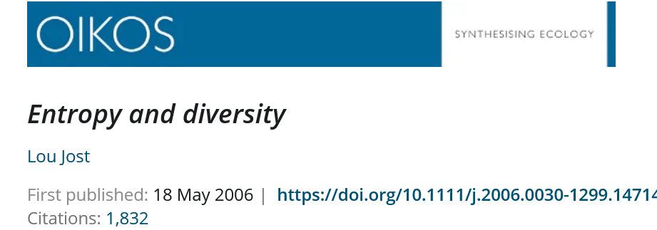

---

### Calculemos el número efectivo de especies con las abundancias estimadas
```{r}
# Extraer los datos de abundancia
hill_data <- cam_diver_inv[[4]] %>% 
  select(-h)
```

Sospechoso...

```{r echo=FALSE}
knitr::kable(head(hill_data), format = 'html')
```
---
# Calculemos diversidad con `hillR`

```{r}
# calcular los perfiles de diversidad
q0 <- hill_taxa(hill_data, q=0) 
q1 <- hill_taxa(hill_data, q=1)
q2 <- hill_taxa(hill_data, q=2)
```

Ahora unimos las bases de datos y las covariables para modelar

```{r}
# Unir las bases de perfiles de diversidad
hill_div <- data.frame(q0=q0, q1=q1, q2=q2)
# Unir con las covariables
glm_hill <- cbind(hill_div, covars)
```

---
# Obtenemos esta base

```{r echo=FALSE}
knitr::kable(head(glm_hill), format = 'html')
```

---
# Ahora ajustemos un glm sencillo

```{r}
glm_q1 <- glm(q1~ Dcrops, family = gaussian, data = glm_hill)
```

y usemos ggeffects para graficar

.pull-left[
```{r , eval=FALSE}
plot_q1 <- ggpredict(glm_q1, terms = "Dpop_G")
plot(plot_q1)+
  labs(y= "Diversidad q1", 
       x= "Distancia a poblados (estandarizado)")+
  theme_classic()
```
]

.pull-right[
```{r echo=FALSE}
plot_q1 <- ggpredict(glm_q1, terms = "Dcrops")
plot(plot_q1)+
  labs(y= "Diversidad q1", x= "Distancia a cultivos (estandarizado)")+
  theme_classic()
```
]
---
class: center

# Tarea
- Modelar los otros perfiles de diversidad
- Crear modelos candidatos con otras covariables y escoger con AIC


---

.pull-left[
# Consideraciones finales

1. El paquete es bueno y agiliza muchos pasos del modelado

2. Cuando no hay ninguna covariable que explique la abundancia, se asume que es constante para todos los sitios. Eso puede subestimar o sobrestimar la abundancia...

3. Abundancia constante: diversidad de la localidad y no de la cámara?

4. Si se usan los índices de entropía se debe saber cómo interpretarlos ([Jost 2006](https://onlinelibrary.wiley.com/doi/abs/10.1111/j.2006.0030-1299.14714.x) ; [Jost et al 2010](https://onlinelibrary.wiley.com/doi/full/10.1111/j.1472-4642.2009.00626.x))]

.pull-right[

]

---
## Un ejemplo de cómo se pueden usar los modelos Royle-Nichols para calcular diversidad
.pull-left[
> Tesis de pregrado premiada por la AMMAC

https://www.youtube.com/watch?v=qaD9NRAg3SQ ]

.pull-right[

<iframe width="560" height="315" src="https://www.youtube.com/embed/qaD9NRAg3SQ" title="YouTube video player" frameborder="0" allow="accelerometer; autoplay; clipboard-write; encrypted-media; gyroscope; picture-in-picture" allowfullscreen></iframe>]
---

class: inverse, center, middle


.pull-left[
# Descanso para un cafecito
```{r, echo=FALSE}
countdown(minutes = 10, seconds = 0, 
          left = 0, right = 0,
          padding = "50px",
          margin = "5%",
          font_size = "6em")
```
]

---
class: inverse, center


# Otra opción elegante
.pull-left[
<br>
### Es posible estimar la riqueza de especies directamente de un modelo jerárquico
Es mejor modelar directamente la variación espacial de la riqueza mientras se considera la detección, eliminando así varias etapas de análisis
]

.pull-right[
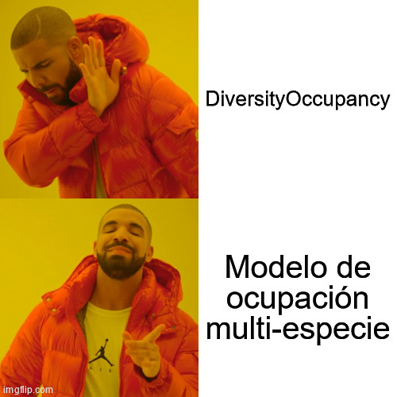
]

---
# Modelo de comunidad Dorazio & Royle (2005)

Es una extensión del modelo de una especie y una temporada en donde se combinan las historias de detección de todas las especies encontradas en los sitios de muestreo
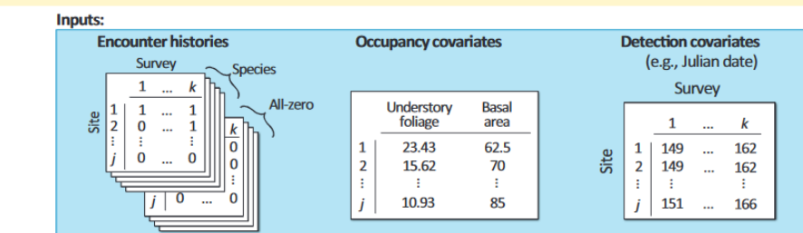

---
class: center
# ¿Cómo funciona?

.pull-left[
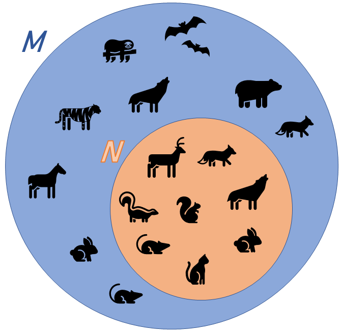
]

.pull-right[
<br>
<br>
Para entender el modelo tenemos que imaginar una comunidad con **N** especies. Al realizar un muestreo encontramos **n** especies. Cómo no sabemos que porcentaje de **n** representa **N**, debemos asumir una comunidad **M** lo suficientemente grande para contener a **N**.]
---
# El aumentado de datos &#x1fa84;

.pull-left[
Es un concepto utilizado bajo el enfoque bayesiano y consiste en agregar un número arbitrario de especies potenciales a la muestra de modo que $M>N$.
<br>
<br>
Este número se define como $nz= M-n$, donde **n** es el número de especies observado y **nz** es el número de especies potenciales adicionadas.
]

.pull-right[
<br>


]

---

# Este modelo tiene tres niveles o procesos

### 1. Primern nivel o super parámetro
El parámetro aumentado describe la probabilidad de que la especie "real" **k** pertenezca a **N**, dado el total de especies potenciales de **M**
$$ \omega{_k} \sim Bernoulli(\Omega) $$
--
Donde $\Omega$ es la probabilidad de que la especie **k** pertenezca a la meta-comunidad de tamaño (desconocido) **N**. En ese sentido $N=M\Omega$, por lo cual al estimar $\Omega$ conoceremos **N**. Esto es posible ya que conocemos **M**.
---

### 2. Segundo nivel o proceso ecológico

Describe la ocupación de las especies en cada sitio *i* siguiendo una distribución *Bernoulli*
$$z_{ik}|w_k\sim Bernoulli(\psi_{k}\omega_k)$$
--
Donde $z_{k}$ son elementos de la matriz de ocupación real y $\psi_{k}$ es la probabilidad de ocupación de cada especie en cada sitio de muestreo dado que este presente en la comunidad.

--
### 3. Tercer nivel o proceso observacional

El proceso de detección o logístico es similar al del modelo de ocupación básico. Puede ser *Binomial* o *Bernoulli* dependiendo del formato de los datos

$$ysum_{ik}|z_{ik}\sim Binomial(J_i,p_{k}z_{ik})$$
--
Donde $ysum_{ik}$ indica la detección o no detección de una especie **k** en el sitio **i** en **J** número de eventos para cada sitio, con una probabilidad de $p_{k}$
---
# El modelo asume heterogeneidad en  psi y p

El modelo asume a cada especie como un **efecto aleatorio**. Es decir, que todas provienen de una misma distribución y son similares pero no iguales. 

Este supuesto hace que  especies con menos datos no difumine la información de la comunidad. Lo que proporciona mayor precisión y habilidad de predicción al parámetro aumentado.
En términos de probabilidad los efectos aleatorios se define así para la ocupación
$$logit(\psi_k)\sim Normal(\mu_{lpsi},\sigma^2_{lpsi})$$

Y así para la detección


$$logit(p_k)\sim Normal(\mu_{lp},\sigma^2_{lp})$$
Donde $\mu$ y $\sigma$ son los parámetros de una distribución normal

---
# ¿Cómo se estiman las especies faltantes?

El modelo usa la información de las especies presentes para estimar las especies sin datos.
Así la probabilidad de no encontrar una especie **k** es:

$$m_k=[1-\psi_{ik}[1-(1-p_k)^J]]^S$$

---
class: center
### ¿Cómo se estiman las especies faltantes?

A medida que tenemos menor $\psi_k$ o $p_k$ pues $N>n$

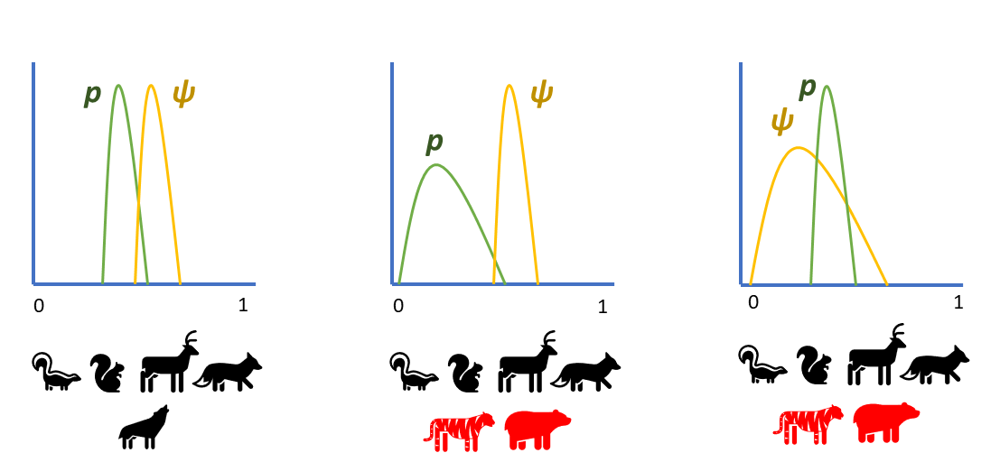

---
# Manos a la obra
### Script `multioccu_script.R`

Recuerden instalar la versión de desarrollo de camtrapR

```{r message=FALSE, warning=FALSE, eval=FALSE}
remotes::install_github("jniedballa/camtrapR")
```

 Lo primero es cargar todas las librerias necesarias.
> Recuerden que para instalar rjags necesitan instalar en su maquina el programa [JAGS](https://sourceforge.net/projects/mcmc-jags/files/)

```{r}
library(camtrapR) # Datos de cámaras y modelos
library(rjags) # Para correr el modelo
library(SpadeR) # Riqueza Chao2
library(tidyverse) # Manipular datos
library(nimble) # LEnguaje BUGS
library(nimbleEcology) # Nimble enfocado en jerárquicos
library(bayesplot) # gráficos estimaciones bayesianas
library(SpadeR) # Riqueza Chao2
library(beepr) # Opcional para avisar R termine
library(tictoc) # Opcional para tomar el tiempo de la función
library(extrafont) #opcional para cambiar la fuente
library(snowfall)
```
---
# Formato de los datos

Vamos a usar los mismos datos que del ejemplo anterior. Seguimos un procedimiento similar para cargar los datos.


```{r message=FALSE, warning=FALSE, eval=FALSE, echo=TRUE}
# Cargamos la tabla de registros de las especies
registers <-  read.csv("Data/Survey/recordTable_OC.csv")

# Cargamos la tabla de operación de cámaras
CToperation <-  read.csv("Data/Survey/CTtable_OC.csv") 

# Generamos la matríz de operación de las cámaras

camop <- cameraOperation(CTtable= CToperation, # Tabla de operación
                         stationCol= "Station", # Columna que define la estación
                         setupCol= "Setup_date", #Columna fecha de colocación
                         retrievalCol= "Retrieval_date", #Columna fecha de retiro
                         hasProblems= T, # Hubo fallos de cámaras
                         dateFormat= "%Y-%m-%d") # Formato de las fechas


```
---
```{r message=FALSE, warning=FALSE, echo=TRUE, eval=FALSE}
# Función para generar las historias de detección para todas las especies seleccionadas

DetHist_list <- lapply(unique(registers$Species), FUN = function(x) {
  detectionHistory(
    recordTable         = registers, # Tabla de registros
    camOp                = camop, # Matriz de operación de cámaras
    stationCol           = "Station",
    speciesCol           = "Species",
    recordDateTimeCol    = "DateTimeOriginal",
    recordDateTimeFormat  = "%d/%m/%Y",
    species              = x,     # la función reemplaza x por cada una de las especies
    occasionLength       = 10, # Colapso de las historias a 10 ías
    day1                 = "station", #inicie en la fecha de cada estación
    datesAsOccasionNames = FALSE,
    includeEffort        = TRUE,
    scaleEffort          = TRUE,
    timeZone             = "America/Mexico_City" 
  )}
)

# Se genera una lista con cada historia de detección y el esfuerzo de muestreo, ahora le colocaremos los nombres para saber a cual especie corresponde
names(DetHist_list) <- unique(registers$Species)

# Finalmente creamos una lista nueva donde estén solo las historias de detección
ylist <- lapply(DetHist_list, FUN = function(x) x$detection_history)
```

Terminaremos con el objeto ylist que cotiente todas las historias de detección

---

### Finalmente las covariables

```{r message=FALSE, warning=FALSE}
## Covariables 

#Cargamos la base de covariables
covars <- read.csv("Data/Covs/stdcovs_OC.csv")

identical(nrow(ylist[[1]]), nrow(covars)) # Verificar que tengan el mismo número de filas
```


---
## Finalmente unimos todo en un objeto lista con los datos que requiere el modelo

```{r}
# Generamos la base de datos para el modelo
data_list <- list(ylist    = ylist, # Historias de detección
                  siteCovs = covars, # Covariables de sitio
                  obsCovs  = list(effort = DetHist_list[[1]]$effort))  # agregamos el esfuerzo de muestreo como covariable de observación

str(data_list)
```

---
## Creando el modelo

CamtrapR permite ajustar modelos multi-especie en JAGS y Nimble (es decir en lenguaje BUGS), nosotros vamos a usar JAGS ya que la versión de Nimble aun no permite estimar parámetro N de riqueza de especies

.pull-left[

```{r}
# Usaremos la función ` communityModel`

# Generemos el modelo
comu_model <- communityModel(data_list, # la lista de datos
                             occuCovs = list(ranef = "Dcrops"), # La covariables de sitio
                             detCovsObservation = list(fixed = "effort"), #Covariables de observación
                             intercepts = list(det = "ranef", occu = "ranef"),
                             augmentation = c(full = 30),# Número aumentado de especies
                             modelFile = "multmod")# Guardamos la especificación en un archivo


```

]

.pull-right[
```{r}
summary(comu_model)
```


]

---

## Hora de correr el modelo

En este caso no corran la función porque dura alrededor de 56 min

```{r eval=F, message=FALSE, warning=FALSE}
fit.commu <- fit(comu_model,
                 n.iter = 22000, 
                 n.burnin = 2000,
                 thin = 2,
                 chains = 3,
                 cores = 3,
                 quiet = T
);beep(sound = 4)

# Duración 56 min aprox
```

```{r message=FALSE, warning=FALSE, echo=FALSE, eval=TRUE}
load("results/DR_result.R")
```

---
## Nuestro resultado

```{r message=FALSE, warning=FALSE}
modresult <- summary(fit.commu)[["statistics"]]


```


```{r message=FALSE, warning=FALSE, echo=FALSE}
DT::datatable(round(modresult, 3))
```

---
### Veamos el resultado gráfico

.pull-left[

Otra gran ventaja de CamtrapR es que permite gráficar de manera muy sencilla la predicción posterior del modelo. Veamos que pasa con la ocupación de cada especie

```{r message=FALSE, warning=FALSE, eval=FALSE}
plot_effects(comu_model, # El modelo
             fit.commu, # El objeto ajustado
             submodel = "state") # el parámetro de interés
```
]

.pull-right[


```{r echo=FALSE, message=FALSE, warning=FALSE, fig.height=5}
plot_effects(comu_model, # El modelo
             fit.commu, # El objeto ajustado
             submodel = "state") # el parámetro de interés
```

]

---

### Ahora los coeficientes

```{r message=FALSE, warning=FALSE}
plot_coef(comu_model,
          fit.commu,
          submodel = "state")
```


---

### Realizamos el mismo procedimiento para el submodelo de detección

```{r message=FALSE, warning=FALSE}
plot_effects(comu_model,
             fit.commu,
             submodel = "det")

```

---

### y sus respectivos coeficientes
```{r message=FALSE, warning=FALSE}
plot_coef(comu_model,
          fit.commu,
          submodel = "det")
```

---
### Lo que vinimos a buscar fue la riqueza de especies

La riqueza estimada de especies es ~20 sps
.pull-left[
```{r message=FALSE, warning=FALSE}
(riqueza_est <- modresult["Ntotal",])
```

```{r, eval=FALSE}
# Veamos el gráfico de la distribución posterior
mcmc_areas(fit.commu, # objeto jags
           pars= "Ntotal", # parámetro de interés
           point_est = "mean",
           prob = 0.95) # intervalos de credibilidad
```
]
.pull-right[
```{r echo=FALSE, message=FALSE, warning=FALSE}
# Veamos el gráfico de la distribución posterior
mcmc_areas(fit.commu, # objeto jags
           pars= "Ntotal", # parámetro de interés
           point_est = "mean",
           prob = 0.95) # intervalos de credibilidad
```

]
---
### La estimación no se ve muy bien, hay que verificar los trace plots

Debería verse como un cesped, muy probablemente necesitamos muchas mas iteraciones para este modelo
```{r message=FALSE, warning=FALSE}
mcmc_trace(fit.commu, pars = "Ntotal")
```


```{r}
gd <- as.data.frame(gelman.diag(fit.commu,  multivariate = FALSE)[[1]])
gd["Ntotal",]
```

La prueba de Gelman-Rubin debe ser ~1 para considerar que hay buena convergencia. Aunque tenemos un valor bueno para Ntotal, hay varios valores de omega con NA, eso puede estar causando los problemas.


---
class:inverse

# Ajustamos nuestro primer modelo de multi-especie. 

Recordemos que **N** es la riqueza estimada a un **área mayor** de nuestro muestreo (área que no conocemos)
.pull-left[
### **N** depende de si cumplimos los supuestos del área
- El muestreo es aleatorio. El área de muestreo debe **representar la región**
- En caso contrario N representa el número de especies un área hipotética con **las mismas condiciones**
- Si la región es pequeña, **N** puede ser **sobre-estimada**
]
.pull-right[
### y de las especies
- Datos de **insectos** no sirven para predecir aves
- Predicción a especies que sean **detectados de manera similar** con la metodología usada.

.footnote[Guillera-Arroita, G, Kéry, M, Lahoz-Monfort, JJ. Inferring species richness using multispecies occupancy modeling: Estimation performance and interpretation. Ecol Evol. 2019; 9: 780– 792. https://doi.org/10.1002/ece3.4821]
]
---
## ¿Será mejor que un estimador no-paramétrico?

```{r message=FALSE, warning=FALSE}
## 5.1 Riqueza con Chao2----

# Formatear los datos a un vector de frecuencia
inci_Chao <- ylist %>%  # historias de captura
  map(~rowSums(.,na.rm = T)) %>% # sumo las detecciones en cada sitio
  reduce(cbind) %>% # unimos las listas
  t() %>% # trasponer la tabla
  as_tibble() %>% #formato tibble
  mutate_if(is.numeric,~(.>=1)*1) %>%  #como es incidencia, formateo a 1 y 0
  rowSums() %>%  # ahora si la suma de las incidencias en cada sitio
  as_tibble() %>% 
 add_row(value= 67, .before = 1) %>%  # el formato requiere que el primer valor sea el número de sitios
  as.matrix() # Requiere formato de matriz


# Calcular la riqueza con estimadores no paramétricos
chao_sp <- ChaoSpecies(inci_Chao, datatype = "incidence_freq")

NIChao <- chao_sp$Species_table[4,c(1,3,4)] # Extraer valores de IChao

Nocu<- mcmc_intervals(fit.commu, pars = "Ntotal", prob = 0.95,prob_outer = 0.99, point_est = "mean")[[1]] %>%  # Extraer valores del bayes plot
  select(m,l,h) %>% # Seleccionar columnas
  rename("Estimate"= m, # Renombrarlas
         "95%Lower"= l,
         "95%Upper"= h)

```


---
# Comparación

Veamos de manera gráfica que tanto difieren las estimaciones de la riqueza

.pull-left[

```{r message=FALSE, warning=FALSE}

# Unir en un solo dataframe
Nplotdata <- rbind(IChao=NIChao, DR.mod=Nocu) %>% 
  as.data.frame() %>% 
  rownames_to_column(.)

# Gráfico para comparar la riqueza estimada
plotN <- ggplot(Nplotdata, aes(x=rowname, y= Estimate, col=rowname))+
  geom_point(aes(shape=rowname),size=3)+
  geom_errorbar(aes(ymin= `95%Lower`, ymax= `95%Upper`), 
                width=.3, size=1)+
  labs(x="Estimador de riqueza",
       y="Número de especies estimado", 
       title = "Diferencia de los estimadores de riqueza")+
  theme_classic()+
  theme(text=element_text(size = 13), 
        plot.title = element_text(hjust= 0.5), 
        legend.position = "none")

```

]

.pull-right[

```{r echo=FALSE, fig.height=5}
plotN
```


]

---
class: inverse

# Ocupación multi-specie vs IChao
.pull-left[


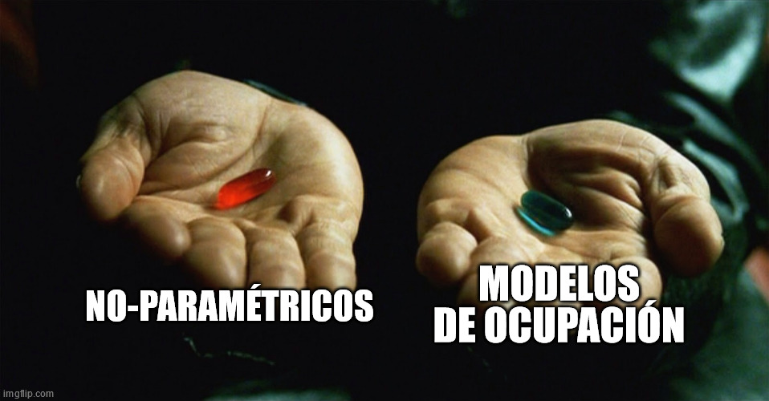

.footnote[ Tingley, MW, Nadeau, CP, Sandor, ME. Multi-species occupancy models as robust estimators of community richness. Methods Ecol Evol. 2020; 11: 633– 642. https://doi.org/10.1111/2041-210X.13378]
]

.pull-right[
Ambos lo hacen muy mal cuando $\psi_k$ es muy **bajo**

- **Chao** siempre estará sesgado al valor **más bajo de N** por no considerar la detección (De hecho Chao lo reconoce)
- Los modelos de ocupación son muy **hambrientos** de datos
- Tienes que saber "**programar**" para ajustar modelos multi-specie 
- Todavía hay algunos bmoles con la heterogeneidad y los prior (Guillera-Arroita et al. 2019)
]

---
# Las posibilidades son infinitas
1. Estructura de la diversidad- Número efectivo de especies
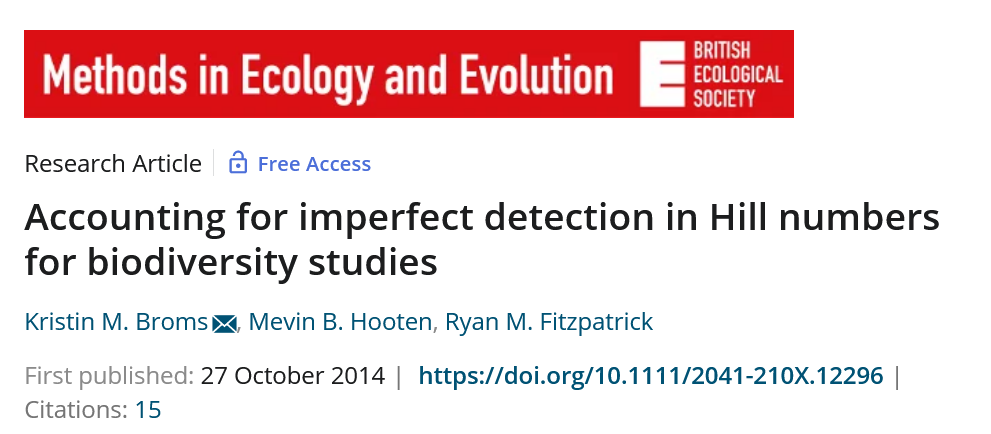
---
## 1. Estructura de la diversidad- Número efectivo de especies

.pull-left[
Cómo la presencia o no de leones afecta la riqueza de meso-carnívoros

>Curveira-Santos Gonçalo, Sutherland Chris, Tenan Simone, Fernández-Chacón lbert, Mann Gareth K. H., Pitman Ross T.and Swanepoel Lourens H. 2021. Mesocarnivore community structuring in the presence of Africa's apex predator. Proc. R. Soc. B.2882020237920202379. http://doi.org/10.1098/rspb.2020.2379

]

.pull-right[ 
]
---
# 2. Diversidad funcional y filogenética
.pull-left[
Las consecuencias de no considerar a especies no detectadas en los análisis.

> Jarzyna, M. A., & Jetz, W. (2016). Detecting the multiple facets of biodiversity. Trends in ecology & evolution, 31(7), 527-538. https://doi.org/10.1016/j.tree.2016.04.002


Les dejo ejemplos divertidos en la carpeta de bibliografía

]

.pull-right[

]

---
class: inverse, center, top

background-image: url("img/peca.JPG")
background-position: 60% 60%
background-size: cover


# .big-text[Gracias]

